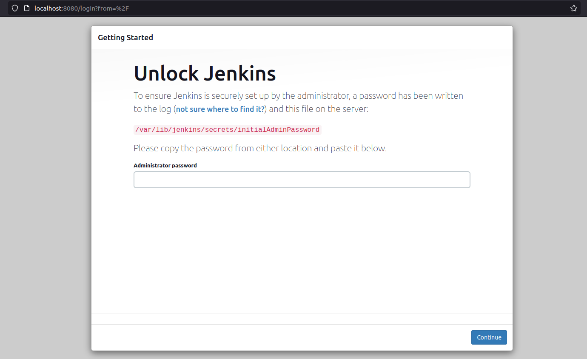
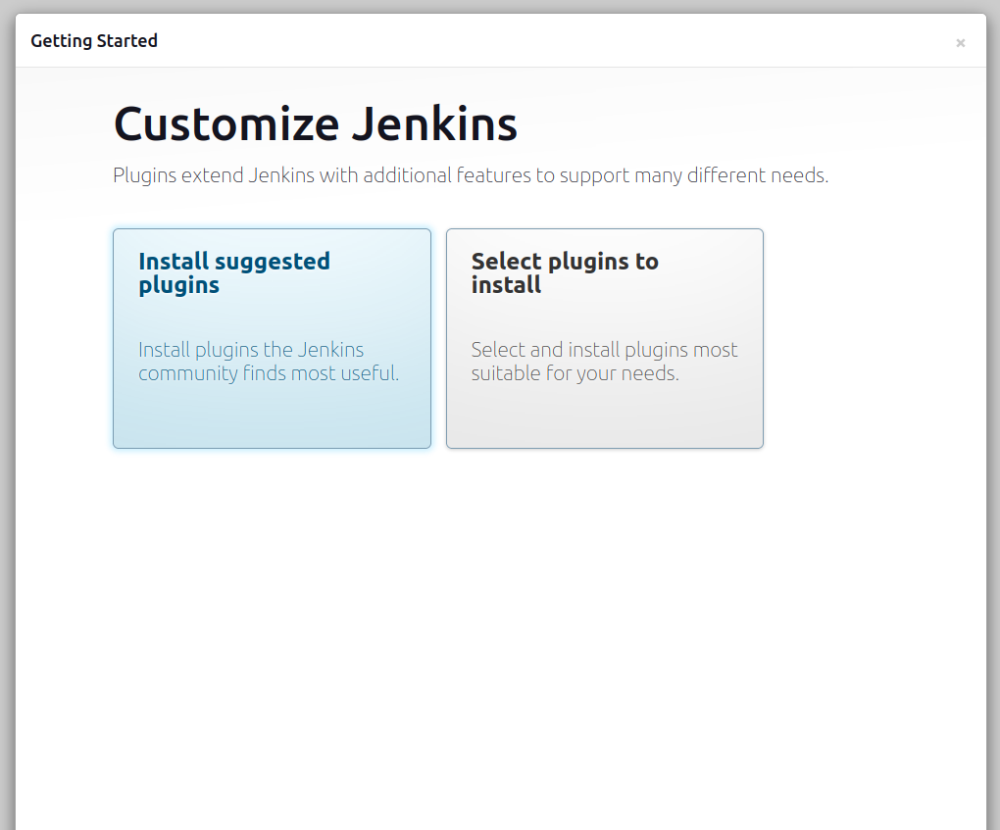
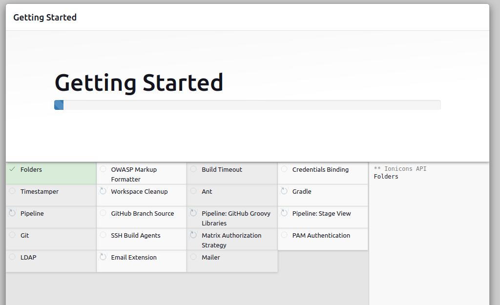
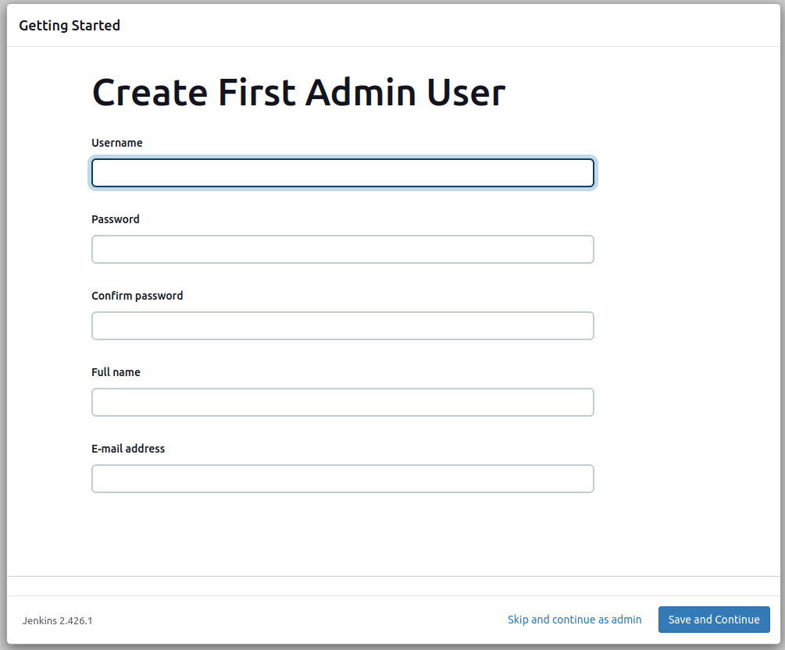
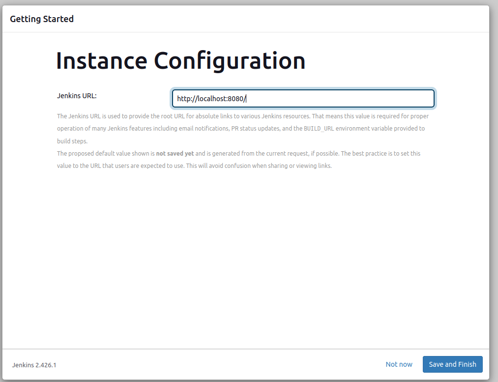
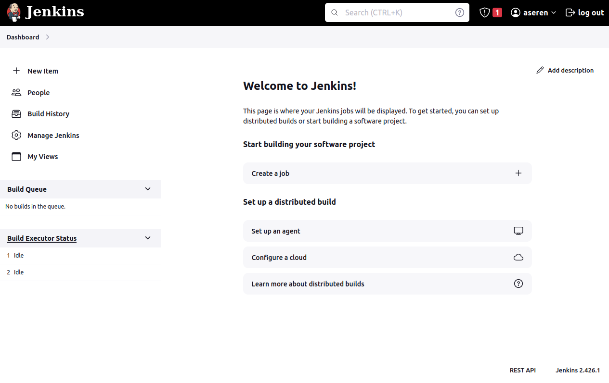
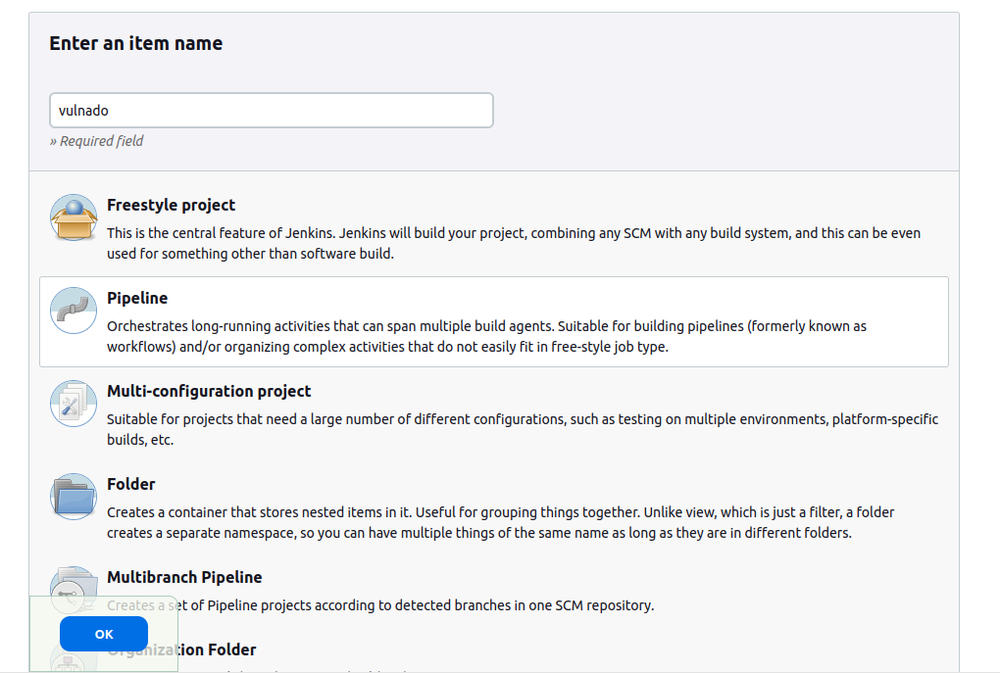
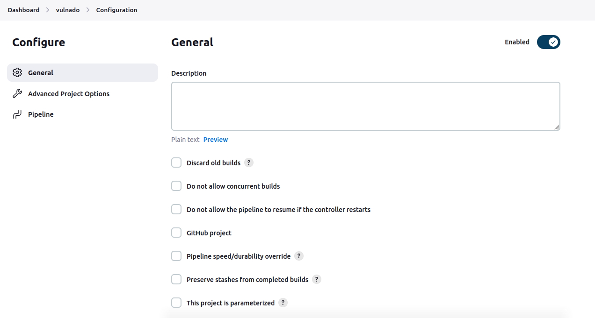
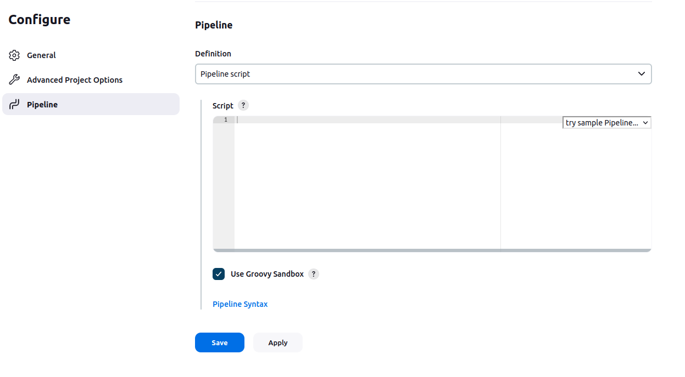

# What is DevSecOps Pipeline?

DevSecOps pipelines are similar to DevOps pipelines. They are like assembly lines for building software, but with a big focus on security. These pipelines automate different tasks, like writing code, testing it, putting it into action, and keeping an eye on it afterward. At each step, they also check for security problems, making sure everything stays safe from the start to the end of the process. This way, everyone involved works together to make sure the software is secure right from the beginning.
# Jenkins Installation
## Download and install Jenkins
First of all, let's setup a Jenkins instance on our machine. Since it has a simple installation and using a container can have a negative impact on performance or storage, I installed Jenkins directly on my virtual machine. I'm using Ubuntu 22.04 on VMware Workstation Pro with 16GB of RAM, 100GB of storage and 8 processor cores. These specs are definitely not a limit or requirement. 

For the installation of Jenkins I simply followed the Ubuntu/Debian section under Linux section in this link: https://www.jenkins.io/doc/book/installing/. It takes you through the installation of Jenkins itself and Java since Jenkins requires Java to run. You can also find minimal and recommended specs, installation guide, troubleshooting and many other useful information about Jenkins. It is very easy to follow but let me give you a spoiler:

Supposed that you have Java installed in your machine, simply run this command:
```bash
sudo wget -O /usr/share/keyrings/jenkins-keyring.asc \
  https://pkg.jenkins.io/debian/jenkins.io-2023.key
echo deb [signed-by=/usr/share/keyrings/jenkins-keyring.asc] \
  https://pkg.jenkins.io/debian binary/ | sudo tee \
  /etc/apt/sources.list.d/jenkins.list > /dev/null
sudo apt-get update
sudo apt-get install jenkins
```
At the end of the installation, you can see that this command has:

- Setup Jenkins as a daemon launched on start,
- Created a ‘jenkins’ user to run this service,
- Directed console log output to systemd-journald,
- Populated /lib/systemd/system/jenkins.service with configuration parameters for the launch, e.g JENKINS_HOME and most importantly,
- Set Jenkins to listen on port 8080. 

## Configure Jenkins
After the installation is complete, go to the Jenkins on your web browser. If you didn't do any custom configuration, it is probably in http://localhost:8080. This page will greet you:

From the given path, receive the initial password and access Jenkins. You may need root access to reach the path.

Choose "Install suggested plugins". We will install required plugins for the steps of our pipeline one by one, from the "Available plugins" section that will be mentioned:



These are the suggested plugins:



After the plugin installation, you are asked to create an admin user for Jenkins. You can choose "Skip and continue as admin" option but you have to use the initial password to access Jenkins. Therefore, I suggest you to create a user. You can use the same credentials as your machine's credentials for easiness:



You can directly choose "Save and Finish" option since our Jenkins is set up locally instead of on a cloud system and we will conduct all scans locally:



If you are seeing this page, congrats! You have successfully installed Jenkins to your system:


Now, let's continue with creating a pipeline.

# Creating a Pipeline

By clicking on "New Item", you will get to this page where Jenkins provides many options. On this page, we will choose "Pipeline" option. In this option, we will create our pipeline from scratch, by coding a Jenkinsfile. "Freestyle project" option provides a better UI and easier way to create a pipeline. However, some steps do not fit easily in Freestyle and once you learn how to create a pipeline from scratch, you will automatically learn how to use other options since this is the base of Jenkins pipelines:



On the opened page, you will see the general options for your project. You can leave them like that for now since our purpose is to learn the basics of a security-based scan and we will test a project that is intentionally vulnerable and isn't a part of a continuing development process:



This is the section which we will create the pipeline from the scratch:


# Step-by-step Pipeline Development

## Overview of pipeline stages
Now, let's have an overview of features in an example security scanning pipeline:
- Checkout: Cloning the project from a Git repository	
- Build: Building the project since some steps require a built project
- SAST: Static Application Security Testing tests upon the code and built project
- Container Security: If there is a container of the project, you can test everything on the container
- Dependency Check: Performs a scan on dependencies of a project and reports if there are any vulnerabilities on them
- SBOM: Software Bill Of Materials is a list of components in a piece of software. SBOMs are useful to determine used technologies in a project and can be used for additional security scans.
- SCA: Software Composition Analysis can be used to automate the identification of vulnerabilities in entire container images, packaged binary files and source code.
- Git Secrets Detection: Can prevent accidental code-commit containing a secret
- DAST: Dynamic Application Security Testing approaches security from the outside. It requires applications be fully compiled and operational to identify network, system and OS vulnerabilities.

These are our stages that we will implement in our pipeline. Jenkins pipelines use a file type called _Jenkinsfile_. It's a different file type that you probably used before but it has a simple syntax. For example, this is a single stage Hello World pipeline script:
```Jenkinsfile
pipeline {
    agent any

    stages {
        stage('Hello') {
            steps {
                echo 'Hello World'
            }
        }
    }
}
```
Jenkins allows you to configure many settings according to your needs. However, these parts are the only required ones for a pipeline. Throughout the development of the pipeline, we will use additional parts and syntax rules for tools we will run in stages. For the additional settings and syntax rules you can visit https://www.jenkins.io/doc/book/pipeline/syntax/.

**Tip:** To add a setting, feature or section, you can use _Pipeline Syntax_ located under Pipeline section:
![[pipeline_syntax.png]]
In Pipeline Syntax, there are useful information about the syntax and most importantly, 2 tools that will assist you: Snippet Generator and Declarative Directive Generator. These tools help you to generate a Jenkinsfile code according your needs and given parameters.

During my learning process, I ran a build for every step to make sure that the code is correct in terms of syntax and configuration. I will follow the same way throughout the note to both show it to you better and remind myself the process.

## Checkout
First of all, let's pull our project we want to scan from a Git repository. For our example project, I chose **Vulnado - Intentionally Vulnerable Java Application**. Here is its link: https://github.com/ScaleSec/vulnado

Every time we start the pipeline or a trigger such as a push or a PR to the repository starts the pipeline, the project will be pulled from the repository. We will use **Git** to perform the pull. Jenkins plugin for Git is installed by default. However, we still need to have Git installed in our machine. To do this, simply run command and install Git binary: 
```bash
sudo apt-get install git
```
After this install, you need to invoke the binary in your Jenkins. For this, you can simply add this command to the pipeline: 
```
git 'https://github.com/ScaleSec/vulnado.git'
```
This command uses Git plugin for Jenkins to interact with the Git binary in our machine. We will usually interact with tools and programs via such plugins to have a stable and efficient pipeline.

This is our code at the end of this step:
```
pipeline {
    agent any

    stages {
        stage('Checkout') {
            steps {
                git 'https://github.com/ScaleSec/vulnado.git'
            }
        }
    }
}
```
Note that we created a stage under "stages" and in this stage, we added the command under "steps". We will follow the same approach for each stage and commands we need to run.
This is the pipeline dashboard after our first build:
![[Pasted image 20231214211411.png]]

## Build
In DevOps and DevSecOps pipelines, **building** is a required stage to see if the changes on the code didn't break the program. If project is successfully built, **testing** stage will start. If the tests are passed, project is finally deployed with a **deployment** stage. In this DevSecOps pipeline, we are aiming to perform security scans and find the vulnerabilities. In other words, we are doing the "testing" part of a traditional pipeline. Therefore, we don't need to bother with building and deploying, *yet*.

Almost every tool in a DevSecOps pipeline requires project to be built to perform efficient scans on them. Some of them build it themselves, some of them don't. Therefore, I usually add a stage to build the project since it can be useful and it is easy to add it to the pipeline.

This project is a Maven project. Therefore, I use a command specific to it to build my project. You can use a different command according to your project to be used in the pipeline:
```
mvn clean package
``` 
Note that an install may be required to build your project. For example, I needed to install Maven on my machine. 

This is the simple command to run on my terminal to build my project and that's what we should do in the pipeline too. To run a shell command, simply put single quotes at the start and end of the command and add "sh" at the beginning of the command. This will be the step to run in Jenkins pipeline: `sh 'mvn clean package'`
This is the final code and result of running the pipeline:
```
pipeline {
    agent any

    stages {
        stage('Checkout') {
            steps {
                git 'https://github.com/ScaleSec/vulnado.git'
            }
        }
        stage('Build') {
            steps {
                sh 'mvn clean package'
            }
        }
    }
}
```
![[Pasted image 20231214213612.png]]

## SAST
Here comes the hard part. Previous steps did not require complex tools and processes. We just pulled and build the project. But from now on, we need to use various tools, install them on our machine and make configurations on both the tools and Jenkins itself.

For the SAST stage, I used SonarQube tool. SonarQube is an open-source platform developed by SonarSource for continuous inspection of code quality to perform automatic reviews with static analysis of code to detect bugs and code smells on more than 30 programming languages. I preferred SonarQube instead of other SAST tools because it has a detailed documentation and plugins about integration with Jenkins and SonarQube works with Java projects pretty well. Of course you can similar multi-language-supported tools such as [Semgrep](https://github.com/semgrep/semgrep) or language-specific tools such as [Bandit](https://github.com/PyCQA/bandit).

Let's start with the simplest one. We need to download the plugin on Jenkins for SonarQube to connect SonarQube and Jenkins. On the main dashboard of Jenkins, go to Manage Jenkins > Plugins > Available plugins and type "sonarqube". SonarQube Scanner plugin should appear on the top.
![[Pasted image 20231214231744.png]]
Mark the box next to the plugin and install the plugin. On the install page, mark the box "Restart Jenkins when installation is complete and no jobs are running" since you need to restart Jenkins eventually to make the plugin available.

![[Pasted image 20231214231840.png]]


Obviously, we must install an instance of SonarQube. You can use a machine on a cloud provider if you want too but for simplicity, we will install a local instance. You can both use a Docker image or the zip file to run SonarQube. Both ways are simple to perform, compatible with Jenkins and this paper. Here is the link and steps for you to follow for installation: https://docs.sonarsource.com/sonarqube/9.8/try-out-sonarqube/

You can understand that installation is successful and ready to be used with Jenkins by trying to access SonarQube by accessing URL http://localhost:9000/ (This is the default URL for SonarQube if you didn't make any custom configuration). This is the first page that will greet you. Your default username and password is "admin". It will ask you to change your password to continue.
![[Pasted image 20231214230716.png]]


This is the dashboard of SonarQube. Since we don't have any projects created, it provides us options to choose a DevOps platform. Usually, GitHub is selected but we won't follow that path. Because choosing GitHub requires us to have a GitHub App. GitHub Apps are tools that extend GitHub's functionality like opening issues, comment on pull requests, and manage projects. They can also do things outside of GitHub based on events that happen on GitHub.
![[Pasted image 20231215160950.png]]

Using such app may be useful for organizations or frequently developed projects. However, this paper's scope is performing a security test on a project and creation of a GitHub App and integrating it to both SonarQube and Jenkins is difficult and unnecessary for a testing pipeline.

Because of this, I want you to choose "Create a local project":
![[Pasted image 20231215144651.png]]

Give a name to your project. A key will be suggested to you but any value is okay.
![[Pasted image 20231215144756.png]]
After this page, you can simply choose "Use the global setting" and create your project.

It will ask you to choose an analysis method. Choose "With Jenkins".
![[Pasted image 20231215144956.png]]
In the next page, choose GitHub for "Select your DevOps platform" and it will provide you some steps. We completed some of them. But we didn't complete some steps about Jenkins and SonarQube integration that are not mentioned here.

For the steps of Jenkins integration, there is a document in [SonarQube's website](https://docs.sonarsource.com/sonarqube/10.3/analyzing-source-code/ci-integration/jenkins-integration/). However, in my opinion SonarQube documentations are not enough and even sometimes, wrong. Therefore, I will show you the correct steps.

On your Jenkins dashboard, go to Manage Jenkins > Credentials. In this page, click on System > Global credentials (unrestricted) > Add credentials. In here:
- Kind must be **Secret Text**
- Scope must be **Global**
- Secret must be token generated on SonarQube. You can easily generate it at User > My Account > Security in SonarQube. Generate a Global Analysis Token and copy and paste it here.
 ![[Pasted image 20231215161203.png]]

Now, from the Jenkins dashboard again, go to Manage Jenkins > System > SonarQube servers. In here, enter a name to your installation, server URL (which is http://localhost:9000 by default) and server authentication token. This is the credential we just added. You should be able to see it in the dropdown menu. Choose it and save.
![[Pasted image 20231215161238.png]]


Now, the final part. On SonarQube, you can see a script that you can add to your pipeline:
![[Pasted image 20231215153140.png]]
However, it needs some adjustments and a fix to work properly. First of all we don't need `def mvn = tool 'Default Maven';` part because our Maven is on the PATH. Because of this, we should change the shell command to: `sh "mvn clean verify sonar:sonar -Dsonar.projectKey=vulnado -Dsonar.projectName='vulnado'"` Finally, we must include an installation name in the script. It is not mentioned on SonarQube but it is necessary. Installation name is the name you entered in previous step. For example, my installation name is "sonar-local" and here is the part of the code: 
`withSonarQubeEnv(installationName: 'sonar-local')`

This is the final code after this step:
```
pipeline {
    agent any

    stages {
        stage('Checkout') {
            steps {
                git 'https://github.com/ScaleSec/vulnado.git'
            }
        }
        stage('Build') {
            steps {
                sh 'mvn clean package'
            }
        }
        stage('SonarQube Analysis') {
            steps{
                withSonarQubeEnv(installationName: 'sonar-local') {
                  sh "mvn clean verify sonar:sonar -Dsonar.projectKey=vulnado -Dsonar.projectName='vulnado'"
                }
            }
        }
    }
}
```

And this is the result of the build:
![[Pasted image 20231215160259.png]]

Note: You can also choose the option of using an installer for SonarQube in the Jenkins settings but I didn't mention it because of showing you the basic steps of installing and using SonarQube for any case.
## Dependency Check

Dependency checks involve evaluating the external components, like libraries and frameworks, used in software development to identify security vulnerabilities, ensure compliance with policies, and mitigate risks.

For this purpose, I used OWASP Dependency-Check (ODC). It is an open-source Software Composition Analysis (SCA) tool that attempts to detect publicly disclosed vulnerabilities contained within a project’s dependencies. You can learn more from [here](https://owasp.org/www-project-dependency-check/)

First of all, you must install the Jenkins plugin for ODC. This plugin will help us to perform a dependency check on our project with minimal configurations. From the plugin page that is shown above, you can simply search for 'dependency-check' and install the plugin.
![[Pasted image 20240310131630.png]]

After installing the plugin, we must choose an installation of ODC to be run in Jenkins. To choose this, go to Manage Jenkins > Tools and in this page, find "Dependency-Check installations" part. In this part, you have the option to add an ODC installation. As you can see on the image, I chose "Install automatically" instead of giving a path to an installation since it is much easier and you can update it easily by changing the version from this part. On "Add installer" drop-down menu, choose "Install from github.com" option, choose a version, give a name to the installation and save the changes. Don't forget this name, we will use it.
![[Pasted image 20240206231043.png]]


Finally, to run this step, you should modify the pipeline script. You can simply add this stage to your script:
```Jenkinsfile
stage('Dependency-Check') {
	steps {
	    dependencyCheck additionalArguments: '', odcInstallation: 'dep-check-auto'
        }
}
```

Here is an important note. "dependencyCheck" option under Snippet Generator can give you a script. However, it is incomplete. It just gives `dependencyCheck additionalArguments: ''` part. Therefore, you should do the steps and use the script above. 

In addition to this command that invokes ODC, I suggest using another command, `dependencyCheckPublisher pattern: ''`. "dependencyCheck" command only invokes ODC and generate an XML file which is usually very large, hard to read and includes unnecessary details. By using this command, you can see the result on a UI that allows user to use the results much easier. You can access to that UI in the build:
![[Pasted image 20240310140353.png]]

Instead of having the result as a UI in Jenkins, you can directly read the file generated by ODC. It is located in the pipeline's workspace which is /var/lib/jenkins/workspace/\<name of the pipeline\>. However, generating the result and storing in the pipeline's workspace can be inefficient since it is hard to access and read through the workspace's path and generated files can affect the project files or processes of other tools running in the pipeline. To avoid this, I use a Jenkins feature called "archiveArtifacts". This Jenkins command will find the desired file(s) and give us the option to download it. Then, it is safe to remove the generated file from the workspace. 
Here is a simple script of archiveArtifacts and a shell command to generate a download link and remove the file from workspace:
```
archiveArtifacts allowEmptyArchive: true, artifacts: 'dependency-check-report.xml', fingerprint: true, followSymlinks: false, onlyIfSuccessful: true
sh ' rm -rf dependency-check-report.xml*'
```
In the archiveArtifacts script 'allowEmptyArchive: true' means that this step does not fail build if archiving returns nothing. artifacts: 'dependency-check-report.xml' is the aprt which we choose the file. Wildcards can be used in the name of the file too. 'fingerprint: true' means that Jenkins fingerprints all archived artifacts. 'onlyIfSuccessful: true' means that Jenkins archives artifacts only if build is successful. Finally 'followSymlinks: false' means that all symbolic links found in the workspace will be ignored. 

Here is the final code after this step:
```
pipeline {
    agent any

    stages {
        stage('Checkout') {
            steps {
                git 'https://github.com/ScaleSec/vulnado.git'
            }
        }
        stage('Build') {
            steps {
                sh 'mvn clean package'
            }
        }
        stage('SonarQube Analysis') {
            steps{
                withSonarQubeEnv(installationName: 'sonar-local') {
                  sh "mvn clean verify sonar:sonar -Dsonar.projectKey=vulnado -Dsonar.projectName='vulnado'"
                }
            }
        }
        stage('Dependency-Check') {
			steps {
			    dependencyCheck additionalArguments: '', odcInstallation: 'dep-check-auto'
			    dependencyCheckPublisher pattern: ''
			    archiveArtifacts allowEmptyArchive: true, artifacts: 'dependency-check-report.xml', fingerprint: true, followSymlinks: false, onlyIfSuccessful: true
sh ' rm -rf dependency-check-report.xml*'
			}
		}
    }
}
```

And this is the result of the build:
![[Pasted image 20240310153628.png]]
In this picture, you can see the small download icon next to the build, artifacts listed above and a graph generated by ODC.

Here is the ODC UI result:
![[Pasted image 20240310140459.png]]

You can find the information about invocation of ODC and the path of generated XML file on console output. It is usually at `/var/lib/jenkins/workspace/vulnado/./dependency-check-report.xml`

Here is another note about your first pipeline run with this step. Depending on you download speed, first run with this step will take relatively longer time than you future runs because at the first run, ODC downloads vulnerabilities from NVD database. You can speed it by using a NVD API key but it is unnecessary since this is a one time process.


# SBOM Generation

SBOM stands for Software Bill of Materials. It's a list of all the components, libraries, and dependencies that are used in building a software product. 

SBOM enhances transparency in the software supply chain, allowing stakeholders to understand component composition and origins. This transparency aids in effective risk management by identifying and prioritizing security risks. SBOM also ensures compliance with regulatory standards.

Also, SBOM facilitates efficient vulnerability management, helping teams quickly address security issues. In the event of a security incident, having an SBOM accelerates response efforts, and its integration into the DevSecOps pipeline enables continuous monitoring for ongoing security assessment throughout the software development lifecycle.

For this part, we will use [Syft](https://github.com/anchore/syft) tool, which is a CLI tool and Go library for generating a Software Bill of Materials (SBOM) from container images and filesystems. Before doing anything on Jenkins side, please install Syft by simply using this script:
```
curl -sSfL https://raw.githubusercontent.com/anchore/syft/main/install.sh | sh -s -- -b /usr/local/bin

```
You can find additional installing methods, guides and more details about Syft on [GitHub page of Syft.](https://github.com/anchore/syft)

Now, we can run Syft on Jenkins by using a shell command. When you type `syft --help` on your terminal, you will see various ways to run Syft for various cases. In our case, we want to scan a directory, which is the directory of Vulnado project. `syft scan dir:path/to/yourproject ` is the command for our case. If you inspect the file hierarchy of Jenkins (you can run a command such as `pwd` in a pipeline or manually inspect the Jenkins files and directories), you will see that everything that we do in the pipeline happens in /var/lib/jenkins/workspace/\<name of the pipeline\>. When we fetch the project files, with our "Checkout" stage, the project is located in this path. Since we are at the same path as the project, we can simply enter "."(dot) as the path to be scanned.

Other than this, we should add `--output` flag to our command to determine the format of the SBOM and its location. You can use this flag like this: `--output <format>=<file>`. To sum up, we should add this command in our stage: `syft scan dir:. --output cyclonedx-json=sbom.json`
I chose "cyclonedx-json" format because CycloneDX is a very common SBOM format and its JSON version is easier to read than default one. You can change it if you want.

In addition to this command, I will add the artifact commands like previous stage. Here is the final code after this step:
```
pipeline {
    agent any

    stages {
        stage('Checkout') {
            steps {
                git 'https://github.com/ScaleSec/vulnado.git'
            }
        }
        stage('Build') {
            steps {
                sh 'mvn clean package'
            }
        }
        stage('SonarQube Analysis') {
            steps{
                withSonarQubeEnv(installationName: 'sonar-docker') {
                  sh "mvn clean verify sonar:sonar -Dsonar.projectKey=vulnado -Dsonar.projectName='vulnado'"
                }
            }
        }
        stage('Dependency-Check') {
			steps {
			    dependencyCheck additionalArguments: '', odcInstallation: 'dep-check-auto'
			    dependencyCheckPublisher pattern: ''
			    archiveArtifacts allowEmptyArchive: true, artifacts: 'dependency-check-report.xml', fingerprint: true, followSymlinks: false, onlyIfSuccessful: true
			    sh ' rm -rf dependency-check-report.xml*'
			}
		}
		stage('Generate SBOM') {
            steps {
                sh '''
                syft scan dir:. --output cyclonedx-json=sbom.json
                '''
                archiveArtifacts allowEmptyArchive: true, artifacts: 'sbom*', fingerprint: true, followSymlinks: false, onlyIfSuccessful: true
                sh ' rm -rf sbom*'
            }
            
        }

    }
}
```

And this is the result of the build:
![[Pasted image 20240310160941.png]]


Note: Artifacts may be not visible at the end of the build. Refresh the page and you will see both the artifact list and the download button next to the build timeline.


# Secrets Detection

Secrets detection is a critical aspect of DevSecOps that involves identifying and managing sensitive information, such as API keys, passwords, and security tokens, embedded within the codebase. By implementing secrets detection early in the CI/CD pipeline, organizations can prevent unauthorized access, mitigate security risks, and ensure compliance with industry standards.

For this part, we will use [detect-secrets](https://github.com/Yelp/detect-secrets), an aptly named module for detecting secrets within a code base. This is a simple but highly effective tool. It is very customizable for various purposes. To show you how to start using it in a pipeline, I'll use its basic features but I encourage you to look for other capabilities of this tool.

This tool is written in Python and installed with Pip. Because of this, we need an adjustment on Jenkins to use it in our pipelines. First of all, let's install the tool with the command:
```
pip install detect-secrets
```
To avoid any possible permission issues, I suggest you to run this command by using the "jenkins" user. In this way, Jenkins won't have any permission issues since it uses its own tool installed by its own user. 

After the installation, you may need to add the path of this tool to Jenkins. By default, Pip installs this and other tools into `$HOME/.local/bin`. In my case, Pip installed detect-secrets into `/var/lib/jenkins/.local/bin`. This may vary according to your Jenkins and Pip configuration. To make sure that the tool is available in the pipeline, we must add this location to the path. 

You can do this manually by using `jenkins` user and changing the path on the terminal. Alternatively, here is an easier way to do it on Jenkins UI. From the dashboard, go to Manage Jenkins > System > Global properties. In this part, check the Environment Variables and add a variable. For the name, type "PATH+WHATEVERYOUWANT". It must be all caps and no space. I did this because sometimes I had issues with other naming methods. For the value, add the path of your tool.
![[Pasted image 20240705000127.png]]

After these steps, detect-secrets is ready to use. I added this stage to my Jenkinsfile. I made it write the output to a text file and give it as an artifact, like previous stages.
```
stage('Secrets Detection') {
            steps {
                sh 'detect-secrets scan > secrets.txt'
                archiveArtifacts allowEmptyArchive: true, artifacts: 'secrets.txt', fingerprint: true, followSymlinks: false, onlyIfSuccessful: true
                sh ' rm -rf secrets.txt'

            }
        }
```
A small tip: By using `--all-files`, you can scan all files recursively, as compared to only scanning Git tracked files. This option is very useful if you are not using Git in your project or if you are using another VCS.

Here is the final code:
```
pipeline {
    agent any

    stages {
        stage('Checkout') {
            steps {
                git 'https://github.com/ScaleSec/vulnado.git'
            }
        }
        stage('Build') {
            steps {
                sh 'mvn clean package'
            }
        }
        stage('SonarQube Analysis') {
            steps{
                withSonarQubeEnv(installationName: 'sonar-docker') {
                  sh "mvn clean verify sonar:sonar -Dsonar.projectKey=vulnado -Dsonar.projectName='vulnado'"
                }
            }
        }
        stage('Dependency-Check') {
			steps {
			    dependencyCheck additionalArguments: '', odcInstallation: 'dep-check-auto'
			    dependencyCheckPublisher pattern: ''
			    archiveArtifacts allowEmptyArchive: true, artifacts: 'dependency-check-report.xml', fingerprint: true, followSymlinks: false, onlyIfSuccessful: true
			    sh ' rm -rf dependency-check-report.xml*'
			}
		}
		stage('Generate SBOM') {
            steps {
                sh '''
                syft scan dir:. --output cyclonedx-json=sbom.json
                '''
                archiveArtifacts allowEmptyArchive: true, artifacts: 'sbom*', fingerprint: true, followSymlinks: false, onlyIfSuccessful: true
                sh ' rm -rf sbom*'
            }
            
        }
        stage('Secrets Detection') {
            steps {
                sh 'detect-secrets scan > secrets.txt'
                archiveArtifacts allowEmptyArchive: true, artifacts: 'secrets.txt', fingerprint: true, followSymlinks: false, onlyIfSuccessful: true
                sh ' rm -rf secrets.txt'

            }
        }

    }
}
```

And this is the result of the build:
![[Pasted image 20240705004348.png]]


**This note will be continued.**
Below, there are just some random scribbles for the general steps.


General steps:

1-) Jenkins Setup (default setup to the machine will suffice) +++

2-) Jenkins configuration and access through browser +++

3-) New pipeline creation (not a freestyle one) +++

4-) Determining the project to be scanned in pipeline +++

5-) Define pipeline steps:
- Checkout +++	=
- Build +++	 =
- SAST +++        =
- Dependency-Check +++ =
- SBOM +++ 	   =
- Container Security 
- SCA 	
- Git Secrets Detection +++	=
- DAST

6-) Jenkins pipeline part by part: Create your Jenkinsfile and run a build for every step to make sure that you are correct in terms of syntax and configuration. Of course it is not necessary but it is a good way to follow during the learning process.


